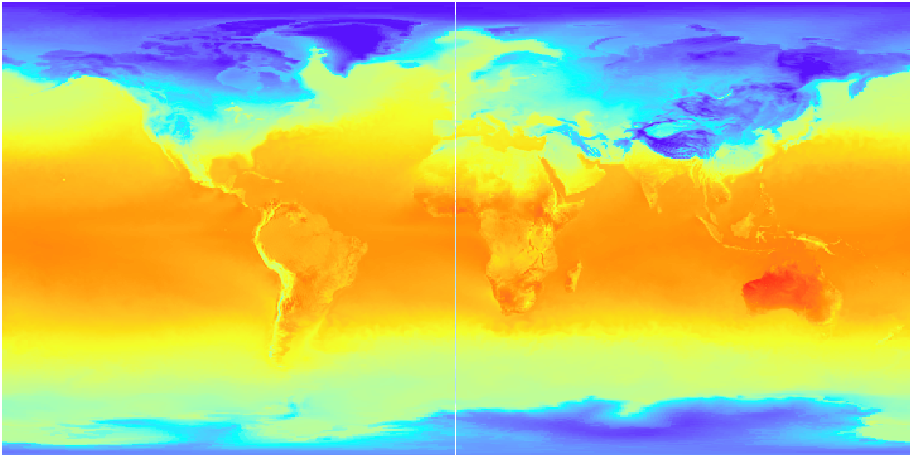
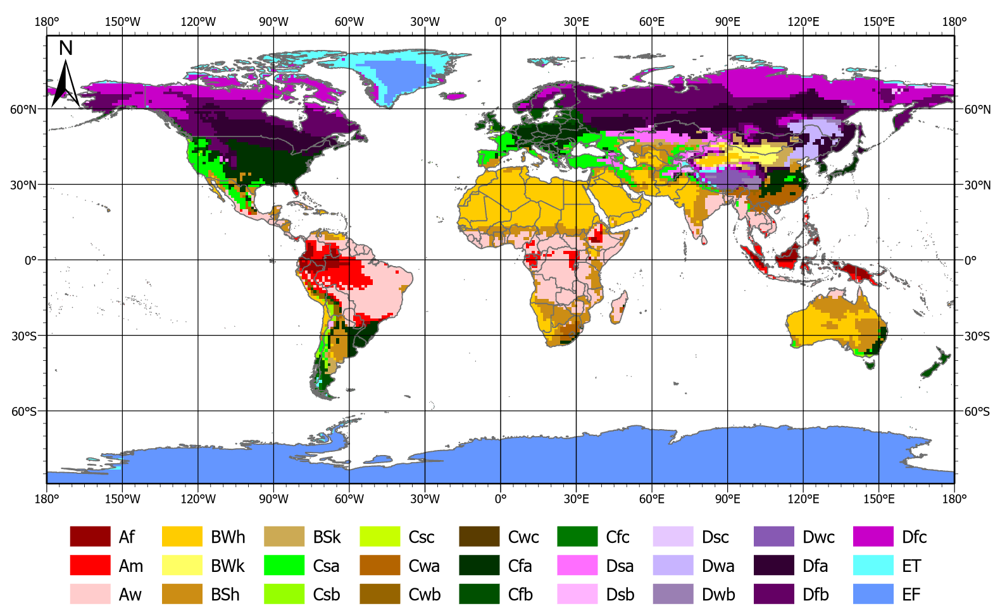

# Koppen-geiger Classification Project for NGEA12 course (Lund's University Geomatics Master's Programme)

The aim and goal of this project was to make a worldwide Koppen-Geiger classification, based on climate normal means for given timespans 1971-2000 and 2091-2100, for comparing and assessing changes in climate zones around the globe. A secondary goal was to create coffee zones 

The scripts requires modules osgeo.gdal, osgeo.osr, netCDF4 and Numpy for calculations and reading files. In addition to modules os and datetime for the ease of the workflow.

* meanclimatevars_koppenclassif.py script calculates the monthly mean values over an indicated timespan, using two NC files -ideally and only tested with CMIP6 data- belonging to a same experiment and realization, one NC file containing temperature data in Kelvins and the second NC file containing precipitation data in kgm-2 s-1. The user only needs to run the script from the same folder as the nc files, set in_netcdf_ts and in_netcdf_pr strings to the name of the NC files; yearSpan, start and finish integers (used for selecting the desired timespan). From within this script, writeMetadata.py script is called for writing in new txt files relevant metadata for each of the NC files.

* After the per-month timespan average is completed, new arrays containing this means are used to classify (based on Beck et al. (2018) parameters [1] and variable thresholds) each of the cells into different climate zones, creating a TIF raster as output.

* The results are not masked as default, using Natural Earth ocean mask vectors was a great way to get desireable results.

* Additionally, a colors.py script is included and intended to use within QGIS for easily setting the color and labels showed in the next figure:

References 
1. Beck, H.E., N.E. Zimmermann, T.R. McVicar, N. Vergopolan, A. Berg, and E.F. Wood. 2018. Present and future Köppen-Geiger climate classification maps at 1-km resolution. Scientific Data 5: 180214. doi: 10.1038/sdata.2018.214
2. Yukimoto, S., T, Koshiro, H, Kawai, N. Oshima, K. Yoshida, S. Urakawa, H. Tsujino, M. Deushi et al. 2019. MRI MRI-ESM2.0 model output prepared for CMIP6 CMIP historical. Version 2019022. Earth System Grid Federation. doi: 10.22033/ESGF/CMIP6.6842
3. https://www.naturalearthdata.com/downloads/10m-physical-vectors/10m-land/

DEPRECATED: this project previously included Arcpy (ArcGIS proprietary), tqdm and multiprocessing modules; it was updated to speed up the processing and become open-source. interpol.py was used instead of classification.py if an interpolation is required for the output, using the same inputs as classification.py, and additionally indicating a scaling integer and method, can be based on the txt as rasters (CUBIC, NEAREST, BILINEAR or MAJORITY) or on points (NNeighbor, IDW, spline or kriging), the latest requires a shapefile with the location of the poitns to use, they can be generated using the writePoints.py script, which uses one of the NC files as geometry input and its resolution must be indicated too, besides, a land_mask shapefile is recommended, because interpolating values in the ocean is not recommended, I used Natural Earth [2] public domain vectors. The methods for classifying climate zones (koppen_beck) and coffee growing zones (coffee) were created as functions, that can be changed in the map calls.
